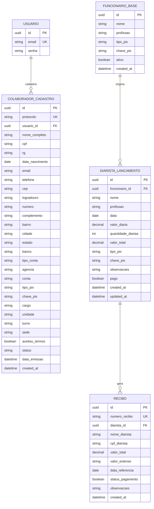

# Plano de Desenvolvimento e Especificação Técnica do Backend
**Distribuidora Irmãos Barreiro — Sistema Web Corporativo**

---

## 1. Visão Geral do Projeto Backend

Este documento especifica a arquitetura, estrutura de dados, endpoints de API e plano de implementação necessário para construir o **Backend** da **Distribuidora Irmãos Barreiro**.

Atualmente, o projeto possui a interface completa em **React + Vite** (no diretório `frontend/meu-projeto`), operando com dados temporários em memória. O objetivo do backend é fornecer **persistência relacional**, **autenticação segura**, **gestão de diaristas/colaboradores**, **emissão de recibos** e **consultas otimizadas para o calendário e busca por autocomplete**.

---

## 2. Tecnologias Recomendadas

Tendo em vista a presença prévia do ambiente `.venv` no diretório `backend/`, recomenda-se a seguinte stack tecnológica:

- **Linguagem**: Python 3.10+
- **Framework Web**: **FastAPI** (Alta performance, documentação OpenAPI/Swagger automática, validações assíncronas nativas)
- **ORM / Banco de Dados**: **SQLAlchemy 2.0** com **Alembic** (migrações de esquema)
- **Validação de Dados**: **Pydantic v2**
- **Banco de Dados**: 
  - *Desenvolvimento*: SQLite (`backend/database.db`)
  - *Produção*: PostgreSQL
- **Autenticação & Hash**: **BCrypt (`passlib.hash.bcrypt`)** para hashing irreversível de senhas.
- **Criptografia de Dados Sensíveis**: **AES-128 / Fernet (`cryptography.fernet`)** simétrica para dados pessoais e financeiros (CPF, RG, Agência, Conta, Chave PIX).
- **Validações / Utilitários**: `num2words` (número por extenso), `pydantic-settings`
- **Servidor ASGI**: **Uvicorn**

> *Nota*: Caso a equipe opte por Node.js, a arquitetura equivalente pode ser implementada com **Express / NestJS + Prisma ORM + PostgreSQL / SQLite**.

---

## 3. Arquitetura do Banco de Dados (Modelagem de Entidades)



### 3.1. Detalhamento Completo das Tabelas do Banco de Dados

1. **`usuarios`** *(Modal 'Entrar no Sistema' em `Navbar.jsx` / `App.jsx`)*:
   - `id`: `UUID` (Chave Primária, gerado automaticamente)
   - `email`: `VARCHAR(255)` (Único, Not Null) — Usuário / E-mail de login
   - `senha`: `VARCHAR(255)` (Not Null) — Senha de acesso

2. **`colaboradores_cadastros`** *(Ficha em `FormularioColaborador.jsx`)*:
   - `id`: `UUID` (Chave Primária)
   - `protocolo`: `VARCHAR(50)` (Único, ex: `IB-2026-849201`)
   - `usuario_id`: `UUID` (Chave Estrangeira -> `usuarios.id`, Nullable)
   - **Etapa 1 - Dados Pessoais**:
     - `nome_completo`: `VARCHAR(150)` (Not Null)
     - `cpf`: `VARCHAR(14)` (Not Null, com validação de dígitos)
     - `rg`: `VARCHAR(30)` (Not Null, RG / Órgão Emissor / UF)
     - `data_nascimento`: `DATE` (Not Null)
   - **Etapa 2 - Contato e Endereço**:
     - `email`: `VARCHAR(255)` (Not Null)
     - `telefone`: `VARCHAR(20)` (Not Null, WhatsApp)
     - `cep`: `VARCHAR(9)` (Not Null, com busca ViaCEP)
     - `logradouro`: `VARCHAR(150)` (Not Null)
     - `numero`: `VARCHAR(20)` (Not Null)
     - `complemento`: `VARCHAR(100)` (Optional)
     - `bairro`: `VARCHAR(100)` (Not Null)
     - `cidade`: `VARCHAR(100)` (Default: 'Cascavel')
     - `estado`: `VARCHAR(2)` (Default: 'CE')
   - **Etapa 3 - Dados Bancários & PIX**:
     - `banco`: `VARCHAR(100)` (Not Null, ex: 'Caixa Econômica Federal', 'Outro')
     - `outro_banco`: `VARCHAR(100)` (Optional, preenchido quando `banco` == 'Outro')
     - `tipo_conta`: `VARCHAR(50)` (Not Null, ex: 'Conta Corrente', 'Conta Poupança')
     - `agencia`: `VARCHAR(20)` (Not Null)
     - `conta`: `VARCHAR(20)` (Not Null com dígito)
     - `tipo_pix`: `VARCHAR(30)` (Not Null, ex: 'CPF', 'Telefone', 'E-mail', 'Aleatória')
     - `chave_pix`: `VARCHAR(100)` (Not Null)
   - **Etapa 4 - Dados Profissionais & Lotação**:
     - `cargo`: `VARCHAR(100)` (Not Null, ex: 'Motorista Entregador', 'Outro')
     - `outro_cargo`: `VARCHAR(100)` (Optional, preenchido quando `cargo` == 'Outro')
     - `unidade`: `VARCHAR(150)` (Default: 'Distrito Industrial de Cascavel - CE')
     - `turno`: `VARCHAR(100)` (Default: 'Diurno (Comercial / Rota)')
     - `sede`: `VARCHAR(255)` (Default: 'Rua João Damasceno Fontenele, nº 5003 - Cascavel/CE')
   - **Etapa 5 - Resumo & Aceite**:
     - `aceitou_termos`: `BOOLEAN` (Not Null, Default: True)
     - `status`: `VARCHAR(30)` (Default: 'PENDENTE', opções: 'PENDENTE', 'VALIDADO', 'REVISAO_SOLICITADA')
     - `data_emissao`: `TIMESTAMP` (Not Null)
     - `created_at`: `TIMESTAMP` (Default: Now)

3. **`funcionarios_base`** *(Catálogo de Funcionários Padrão para Busca Inteligente/Autocomplete em `CadastrarDiarista.jsx`)*:
   - `id`: `UUID` (Chave Primária)
   - `nome`: `VARCHAR(150)` (Not Null, Indexado para busca autocomplete `LIKE %nome%`)
   - `profissao`: `VARCHAR(100)` (ex: *Ajudante de Carga / Descarga*, *Motorista Entregador*, *Conferente de Mercadorias*)
   - `tipo_pix`: `VARCHAR(30)` (ex: `cpf`, `telefone`, `email`, `aleatoria`)
   - `chave_pix`: `VARCHAR(100)` (Not Null)
   - `ativo`: `BOOLEAN` (Default: True)
   - `created_at`: `TIMESTAMP` (Default: Now)

4. **`diaristas_lancamentos`** *(Lançamentos de Diárias exibidos em `RelacaoDiaristas.jsx` e criados em `CadastrarDiarista.jsx`)*:
   - `id`: `UUID` (Chave Primária)
   - `funcionario_id`: `UUID` (Chave Estrangeira -> `funcionarios_base.id`, Nullable)
   - `nome`: `VARCHAR(150)` (Not Null)
   - `profissao`: `VARCHAR(100)` (Not Null)
   - `data`: `DATE` (Not Null, Indexado) — Data do trabalho/diária em formato ISO (`YYYY-MM-DD`). **Essencial para a navegação por dia e Mini-Calendário.**
   - `valor_diaria`: `DECIMAL(10, 2)` (Not Null)
   - `quantidade_diarias`: `INTEGER` (Not Null, Default: 1)
   - `valor_total`: `DECIMAL(10, 2)` (Calculado automaticamente: `valor_diaria * quantidade_diarias`)
   - `tipo_pix`: `VARCHAR(30)` (Not Null)
   - `chave_pix`: `VARCHAR(100)` (Not Null)
   - `observacoes`: `TEXT` (Optional)
   - `pago`: `BOOLEAN` (Not Null, Default: False — Alterna entre *Já Pago* e *Pendente*)
   - `created_at`: `TIMESTAMP` (Default: Now)
   - `updated_at`: `TIMESTAMP` (Default: Now)

5. **`recibos`** *(Emissão e Quitação em `ReciboIndividual.jsx`)*:
   - `id`: `UUID` (Chave Primária)
   - `numero_recibo`: `VARCHAR(50)` (Único, ex: `REC-2026-00129`)
   - `diarista_id`: `UUID` (Chave Estrangeira -> `diaristas_lancamentos.id`, Nullable)
   - `nome_diarista`: `VARCHAR(150)` (Not Null)
   - `cpf_diarista`: `VARCHAR(20)` (Not Null/Optional)
   - `funcao`: `VARCHAR(100)`
   - `valor_unitario`: `DECIMAL(10, 2)`
   - `dias_trabalhados`: `INTEGER`
   - `tem_almoco`: `BOOLEAN` (Default: True)
   - `valor_almoco`: `DECIMAL(10, 2)` (Default: 0.00 ou 20.00)
   - `valor_total`: `DECIMAL(10, 2)` (Not Null)
   - `valor_extenso`: `TEXT` (Not Null, ex: *"Cento e Quarenta Reais"*)
   - `tipo_pix`: `VARCHAR(30)`
   - `chave_pix`: `VARCHAR(100)`
   - `data_referencia`: `DATE` (Not Null)
   - `status_pagamento`: `BOOLEAN` (Not Null, Default: True)
   - `observacoes`: `TEXT`
   - `created_at`: `TIMESTAMP` (Default: Now)

---

### 3.2. Mapeamento Direto dos Componentes React (.JSX) para o Banco

| Componente React (`src/components/`) | Estado / Campo Frontend | Tabela Backend | Coluna no Banco |
| :--- | :--- | :--- | :--- |
| **`Navbar.jsx` / `App.jsx`** | `email` | `usuarios` | `email` |
| **`Navbar.jsx` / `App.jsx`** | `password` | `usuarios` | `senha` |
| **`FormularioColaborador.jsx`** | `formData.nome` | `colaboradores_cadastros` | `nome_completo` |
| **`FormularioColaborador.jsx`** | `formData.cpf` | `colaboradores_cadastros` | `cpf` |
| **`FormularioColaborador.jsx`** | `formData.rg` | `colaboradores_cadastros` | `rg` |
| **`FormularioColaborador.jsx`** | `formData.dataNascimento` | `colaboradores_cadastros` | `data_nascimento` |
| **`FormularioColaborador.jsx`** | `formData.email` | `colaboradores_cadastros` | `email` |
| **`FormularioColaborador.jsx`** | `formData.telefone` | `colaboradores_cadastros` | `telefone` |
| **`FormularioColaborador.jsx`** | `formData.cep` | `colaboradores_cadastros` | `cep` |
| **`FormularioColaborador.jsx`** | `formData.logradouro` | `colaboradores_cadastros` | `logradouro` |
| **`FormularioColaborador.jsx`** | `formData.numero` | `colaboradores_cadastros` | `numero` |
| **`FormularioColaborador.jsx`** | `formData.complemento` | `colaboradores_cadastros` | `complemento` |
| **`FormularioColaborador.jsx`** | `formData.bairro` | `colaboradores_cadastros` | `bairro` |
| **`FormularioColaborador.jsx`** | `formData.cidade` / `formData.estado` | `colaboradores_cadastros` | `cidade` / `estado` |
| **`FormularioColaborador.jsx`** | `formData.banco` / `outroBanco` | `colaboradores_cadastros` | `banco` / `outro_banco` |
| **`FormularioColaborador.jsx`** | `formData.tipoConta` / `agencia` / `conta` | `colaboradores_cadastros` | `tipo_conta` / `agencia` / `conta` |
| **`FormularioColaborador.jsx`** | `formData.tipoPix` / `chavePix` | `colaboradores_cadastros` | `tipo_pix` / `chave_pix` |
| **`FormularioColaborador.jsx`** | `formData.cargo` / `outroCargo` | `colaboradores_cadastros` | `cargo` / `outro_cargo` |
| **`FormularioColaborador.jsx`** | `protocolo` | `colaboradores_cadastros` | `protocolo` |
| **`CadastrarDiarista.jsx`** | `termoBusca` / `funcionarioSelecionado` | `funcionarios_base` | `nome`, `profissao`, `chave_pix` |
| **`CadastrarDiarista.jsx`** | `formData.nome` | `diaristas_lancamentos` | `nome` |
| **`CadastrarDiarista.jsx`** | `formData.profissao` (`outraFuncao`) | `diaristas_lancamentos` | `profissao` |
| **`CadastrarDiarista.jsx`** | `formData.data` | `diaristas_lancamentos` | `data` |
| **`CadastrarDiarista.jsx`** | `formData.valorDiaria` | `diaristas_lancamentos` | `valor_diaria` |
| **`CadastrarDiarista.jsx`** | `formData.quantidadeDiarias` | `diaristas_lancamentos` | `quantidade_diarias` |
| **`CadastrarDiarista.jsx`** | `totalCalculado` | `diaristas_lancamentos` | `valor_total` |
| **`CadastrarDiarista.jsx`** | `formData.tipoPix` / `chavePix` | `diaristas_lancamentos` | `tipo_pix` / `chave_pix` |
| **`CadastrarDiarista.jsx`** | `formData.pago` | `diaristas_lancamentos` | `pago` |
| **`RelacaoDiaristas.jsx`** | `dataSelecionada` / `activeData` | `diaristas_lancamentos` | Filtro SQL `WHERE data = :activeData` |
| **`RelacaoDiaristas.jsx`** | `contagemPorData` | `diaristas_lancamentos` | Consulta `SELECT data, COUNT(*) FROM diaristas_lancamentos GROUP BY data` |
| **`ReciboIndividual.jsx`** | `dadosRecibo` | `recibos` | `nome_diarista`, `valor_total`, `valor_extenso`, `data_referencia`, `status_pagamento` |

---

## 4. ESPECIFICAÇÃO DE ENDPOINTS HTTP (API RESTful)

### 4.1. Módulo de Autenticação (`/api/v1/auth`)

| Método | Rota | Descrição | Parâmetros/Body | Resposta esperada |
| :--- | :--- | :--- | :--- | :--- |
| `POST` | `/api/v1/auth/login` | Autentica usuário no modal 'Entrar no Sistema' | `{ email, senha }` | `{ access_token, token_type, user: { id, email } }` |
| `GET` | `/api/v1/auth/me` | Retorna o usuário logado via Token JWT | Header `Authorization: Bearer <token>` | `{ id, email }` |

---

### 4.2. Módulo de Relatório Individual / Ficha de Colaborador (`/api/v1/colaboradores`)

| Método | Rota | Descrição | Parâmetros/Body | Resposta esperada |
| :--- | :--- | :--- | :--- | :--- |
| `POST` | `/api/v1/colaboradores` | Salva o formulário completo e gera o protocolo `IB-YYYY-XXXXXX` | Objeto completo do formulário (Etapas 1 a 4 + aceite) | `{ id, protocolo, data_emissao, status }` |
| `GET` | `/api/v1/colaboradores` | Lista fichas cadastradas com paginação e filtros (RH/Admin) | `?search=cpf_ou_nome&status=PENDENTE&page=1` | `{ items: [...], total, page, pages }` |
| `GET` | `/api/v1/colaboradores/{id}` | Retorna detalhes completos de uma ficha | Path `id` | Dados completos da ficha |
| `PATCH` | `/api/v1/colaboradores/{id}/status` | Atualiza o status do cadastro (`VALIDADO`, `REVISAO_SOLICITADA`) | Path `id`, Body `{ status }` | `{ id, status, updated_at }` |

---

### 4.3. Módulo Banco de Funcionários Base (`/api/v1/funcionarios-base`)
*Utilizado para o Auto-preenchimento (Autocomplete / Busca Inteligente) na tela de Cadastrar Diarista.*

| Método | Rota | Descrição | Parâmetros/Body | Resposta esperada |
| :--- | :--- | :--- | :--- | :--- |
| `GET` | `/api/v1/funcionarios-base` | Busca funcionários cadastrados no catálogo base | `?q=nome_ou_pix` | `[ { id, nome, profissao, tipo_pix, chave_pix } ]` |
| `POST` | `/api/v1/funcionarios-base` | Cadastra novo funcionário no catálogo base | `{ nome, profissao, tipo_pix, chave_pix }` | `{ id, nome, ... }` |
| `PUT` | `/api/v1/funcionarios-base/{id}` | Atualiza dados no catálogo base | Path `id`, Body `{ ... }` | Objeto atualizado |

---

### 4.4. Módulo Relação de Diaristas (`/api/v1/diaristas`)

| Método | Rota | Descrição | Parâmetros/Body | Resposta esperada |
| :--- | :--- | :--- | :--- | :--- |
| `GET` | `/api/v1/diaristas` | Retorna lançamentos de diárias filtradas por data | `?data=YYYY-MM-DD` | `[ { id, nome, valor_diaria, quantidade_diarias, valor_total, tipo_pix, chave_pix, profissao, pago, data } ]` |
| `GET` | `/api/v1/diaristas/datas-disponiveis` | Retorna datas registradas e a contagem por dia para o mini-calendário | N/A | `{ "2026-09-02": 5, "2026-09-01": 3 }` |
| `POST` | `/api/v1/diaristas` | Registra nova diária individual no dia especificado | `{ nome, valor_diaria, quantidade_diarias, tipo_pix, chave_pix, profissao, data, observacoes, pago }` | Lançamento criado com `valor_total` calculado |
| `PATCH` | `/api/v1/diaristas/{id}/status-pago` | Alterna status de pagamento (`pago: true/false`) | Path `id` | `{ id, pago }` |
| `PUT` | `/api/v1/diaristas/{id}` | Edita dados da diária | Path `id`, Body `{ ... }` | Objeto editado |
| `DELETE` | `/api/v1/diaristas/{id}` | Exclui lançamento da diária | Path `id` | `{ success: true, message: "Removido" }` |
| `DELETE` | `/api/v1/diaristas/reset` | Reseta lançamentos (por dia ou geral) | `?data=YYYY-MM-DD` | `{ message: "Relação limpa" }` |

---

### 4.5. Módulo Recibo Individual (`/api/v1/recibos`)

| Método | Rota | Descrição | Parâmetros/Body | Resposta esperada |
| :--- | :--- | :--- | :--- | :--- |
| `POST` | `/api/v1/recibos` | Registra a emissão de um recibo no backend | `{ diarista_id, nome_diarista, valor_total, data_referencia, status_pagamento }` | `{ id, numero_recibo, valor_extenso, created_at }` |
| `GET` | `/api/v1/recibos/extenso` | Utilitário backend para conversão de valor em extenso | `?valor=140.00` | `{ valor: 140.00, extenso: "Cento e Quarenta Reais" }` |

---

## 5. REGRAS DE NEGÓCIO DA APLICAÇÃO

1. **Auto-cálculo do Valor Total**:
   - Sempre que uma diária for inserida ou editada com `valor_diaria = X` e `quantidade_diarias = Y`, o backend deve calcular `valor_total = X * Y`.

2. **Auto-preenchimento Inteligente**:
   - Quando o usuário cadastrar um diarista selecionando um funcionário base, o backend vincula o `funcionario_id`, mas salva uma cópia independente em `diaristas_lancamentos` para não alterar os lançamentos retroativos caso a chave PIX mude no futuro.

3. **Geração de Protocolo Único**:
   - Para o formulário individual do colaborador, o protocolo deve seguir o formato `IB-{ANO}-{SEQUENCIAL_OU_HASH}`, garantindo imutabilidade e rastreabilidade.

4. **Tratamento de Datas e Fuso Horário**:
   - Todas as datas de referência de diárias são tratadas em formato ISO `YYYY-MM-DD` mantendo consistência com o fuso local (`America/Fortaleza` / `America/Sao_Paulo`).

5. **Validação Estrita do CPF**:
   - O backend deve validar o algoritmo do dígito verificador do CPF antes de salvar cadastros na tabela `colaboradores_cadastros`.

---

## 6. ESTRUTURA DE PASTAS RECOMENDADA NO BACKEND

```
backend/
├── app/
│   ├── api/
│   │   ├── v1/
│   │   │   ├── endpoints/
│   │   │   │   ├── auth.py
│   │   │   │   ├── colaboradores.py
│   │   │   │   ├── diaristas.py
│   │   │   │   ├── funcionarios.py
│   │   │   │   └── recibos.py
│   │   │   └── api.py
│   ├── core/
│   │   ├── config.py         # Variáveis de Ambiente (.env)
│   │   ├── security.py       # Hashing & Tokens JWT
│   │   └── database.py       # Conexão com SQLAlchemy DB Engine
│   ├── models/               # Entidades SQLAlchemy DB Models
│   │   ├── usuario.py
│   │   ├── colaborador.py
│   │   ├── funcionario.py
│   │   ├── diarista.py
│   │   └── recibo.py
│   ├── schemas/              # Pydantic Schemas (Validação de Entrada/Saída)
│   │   ├── auth.py
│   │   ├── colaborador.py
│   │   ├── diarista.py
│   │   └── funcionario.py
│   ├── services/             # Regras de Negócio, Extenso, PDF & Protocolo
│   │   ├── extenso.py
│   │   └── protocolo.py
│   └── main.py               # Inicialização da aplicação FastAPI & CORS
├── alembic/                  # Script de migração de banco de dados
├── requirements.txt          # Dependências Python
├── .env.example              # Exemplo de configuração de variáveis
└── README.md
```

---

## 7. INTEGRAÇÃO COM O FRONTEND REACT

1. **Cliente HTTP Centralizado (`src/services/api.js`)**:
   - Criar uma instância do `axios` apontando para `http://localhost:8000/api/v1`.
   - Adicionar Interceptor para enviar o Token JWT automaticamente em todas as requisições autenticadas.

2. **Substituição de Estados Locais por Chamadas à API**:
   - Em `PortalColaborador.jsx`: Substituir a lista em memória `diaristas` pelas buscas da API via `useEffect`.
   - Em `CadastrarDiarista.jsx`: Substituir a busca estática local pela rota `GET /api/v1/funcionarios-base?q=...`.
   - Em `RelacaoDiaristas.jsx`: Atualizar status de pagamento via `PATCH /api/v1/diaristas/{id}/status-pago`.
   - Em `FormularioColaborador.jsx`: Submeter o formulário para `POST /api/v1/colaboradores`.

---

## 8. PASSO A PASSO PARA EXECUÇÃO DA IMPLEMENTAÇÃO

- [ ] **Fase 1**: Ativar o `.venv` e instalar dependências (`fastapi`, `uvicorn[standard]`, `sqlalchemy`, `alembic`, `pydantic`, `python-jose`, `passlib[bcrypt]`, `num2words`, `python-multipart`).
- [ ] **Fase 2**: Configurar banco de dados, conexão com SQLAlchemy e criar migração inicial com Alembic.
- [ ] **Fase 3**: Criar usuário admin inicial (seed) e implementar endpoints de Autenticação.
- [ ] **Fase 4**: Implementar CRUD de `funcionarios_base` e preencher com a carga inicial de colaboradores da distribuidora.
- [ ] **Fase 5**: Implementar endpoints de `diaristas_lancamentos` com suporte a filtros por data e calendário.
- [ ] **Fase 6**: Implementar endpoints de `colaboradores_cadastros` e emissão de recibos.
- [ ] **Fase 7**: Configurar CORS no FastAPI (`CORSMiddleware`) permitindo `http://localhost:5173` (Frontend Vite).
- [ ] **Fase 8**: Conectar o frontend React às APIs e realizar testes integrados de ponta a ponta.

---
*Documento preparado especialmente para o projeto Distribuidora Irmãos Barreiro.*
